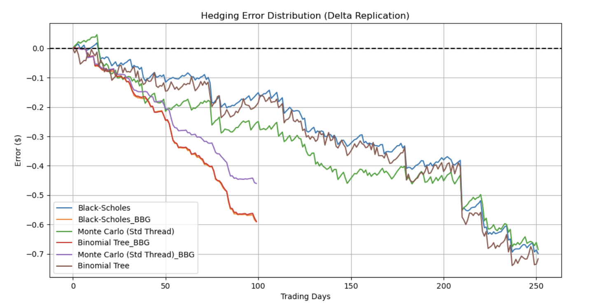

# Option Pricing & Backtesting Engine

## **Overview**

A high-performance **Option Pricing Engine** developed in **C++** to value derivatives and simulate dynamic delta-hedging strategies. The system implements both analytical and numerical methods to price European options and provides a robust backtesting framework to analyze hedging errors across diverse market scenarios.

## **Key Features**

* **Multi-Model Pricing Engine** : Implements **Black-Scholes** (analytical), **Binomial Tree** (iterative/Cox-Ross-Rubinstein), and **Monte Carlo** (stochastic simulation) models.
* **Institutional Backtesting** : Features a **self-financing portfolio** simulation that accounts for initial premium inflows, rebalancing costs, and **risk-free interest accrual** on cash balances.
* **Optimized Performance** :
* **Parallel Computing** : Utilizes standard C++ threading (`std::future`, `std::async`) to parallelize Monte Carlo path generation across all CPU cores.
* **Memory Optimization** : Implements an **$O(N)$** memory-optimized 1D-array structure for the Binomial Tree, reducing space complexity from **$O(N^2)$**.
* **Data Flexibility** : Robust data pipeline capable of parsing standard CSVs, **Yahoo Finance** data, and **Bloomberg Terminal** exports.
* **Quantitative Analytics** : Automated generation of risk metrics including  **Mean Hedging Error** ,  **Error Standard Deviation** , and  **Max Deviation** .

Project Structure

`OptionPricingEngine/
├── src/            # C++ Source (Engine, Backtester, Logger)
├── include/        # C++ Headers (Pricing Interface, Types)
├── scripts/        # Python Tools (Data retrieval, Metrics, Plotting)
├── data/           # Market datasets (CSV)
├── logs/           # Backtest results and system logs
└── Makefile        # Build automation`

Performance



How to Run

```bash
# 1. Generate/Fetch Data (Yahoo Finance, Synthetic, and Bloomberg formats)
python3 scripts/data_manager.py
# 2. Compile the C++ Engine (Optimized with -O3 and -pthread)
make clean && make
# 3. Run the Backtest Simulation
./OptionEngine
# 4. View raw results
ls -l logs/
# 5. Visualize Hedging Error
python3 scripts/plot_results.py
# 6. Calculate Quantitative Risk Metrics
python3 scripts/final_metrics.py
```
